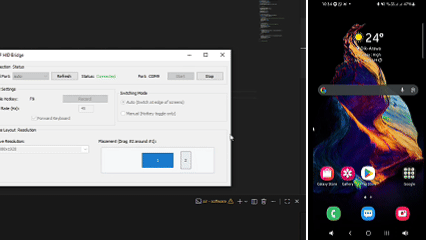

# ESP HID Bridge

ESP HID Bridge lets a Windows PC forward mouse and keyboard input to an ESP32 over USB serial, then the ESP32 re-emits it as Bluetooth LE HID (mouse + keyboard) to a paired phone/tablet.

## Highlights

- Windows-native sender written in Go.
- ESP32 firmware using BLE Combo HID.
- GUI mode (default) with system tray behavior.
- CLI mode for terminal-only workflows.
- Auto serial reconnect and safety key/button release.
- Remote mode toggle hotkey (configurable combo, e.g. `Alt+F7`), gated by serial connection health.
- Dual switching modes: **Auto** (edge-based) and **Manual** (hotkey-only).

## Demo

[](https://youtu.be/TuCsHALIvrs)

## Repository Layout

- `firmware/`: Arduino sketch and serial command parser for ESP32.
- `firmware/libraries/ESP32-BLE-Combo/`: bundled BLE Combo library copy.
- `software/`: Windows sender app (hooks, serial runtime, GUI, tray integration).
- `software/main.go`: program entrypoint (`-gui=true` by default).

## How It Works

1. The Windows app installs low-level input hooks.
2. In remote mode, mouse/keyboard activity is converted into compact text commands.
3. Commands are sent over USB serial to the ESP32.
4. ESP32 parses commands and emits BLE HID reports to the paired target device.

## Requirements

### Firmware Side

- ESP32 development board.
- Arduino IDE 2.x.
- Espressif ESP32 board package.

### Software Side

- Windows 10/11.
- Go 1.22+.
- USB serial connection to ESP32.

## Firmware Setup (ESP32)

1. Open `firmware/firmware.ino` in Arduino IDE.
2. Select your ESP32 board and COM port.
3. Ensure the `ESP32-BLE-Combo` library is available in your Arduino `libraries` folder.
	 - **IMPORTANT**: This repository bundles a specific version of `ESP32-BLE-Combo` that is already patched to support ESP32 Core `3.x.x`.
	 - **Recommended Method**: Create a shortcut or symbolic link (symlink) from `firmware/libraries/ESP32-BLE-Combo/` to your local Arduino `libraries` folder (usually located in `Documents/Arduino/libraries` in Windows). This ensures you use the patched version while keeping it synchronized with the repo.
4. Build and upload.

Default firmware values:

- Serial baud: `460800`.
- BLE device name: `PC Bridge Combo`.
- BLE manufacturer: `ESP HID Bridge`.

### Build/Flash With Arduino CLI

From `firmware/`:

```powershell
# Build firmware into firmware\out\
arduino-cli compile --fqbn esp32:esp32:esp32 --libraries libraries --output-dir out .

# Flash previously built firmware (replace COM9 with your ESP32 port)
arduino-cli upload -p COM9 -b esp32:esp32:esp32 --input-dir out -t
```

## Software Setup (Windows)

From `software/`:

```powershell
go mod tidy
# Production GUI build (no terminal window when opening the EXE)
go build -trimpath -ldflags "-H=windowsgui -s -w" -o esp-hid-bridge.exe .
```

Optional helper script:

```powershell
.\build-production.ps1
```

If you run `go build .`, Go produces a console-subsystem EXE (`software.exe`) which opens a terminal window.

Run GUI mode (default):

```powershell
.\esp-hid-bridge.exe
```

Run CLI mode:

```powershell
.\esp-hid-bridge.exe -gui=false -port auto
```

## GUI Behavior

- App starts hidden in system tray.
- Left-click tray icon opens the main window.
- Closing the window hides it to tray.
- Tray menu `Exit` fully terminates the app.

Bridge status in GUI:

- Green text: connected.
- Amber text: transitional/waiting state (starting/stopping/stopped).
- Red text: connection/capture failure.

## Settings Persistence

- User settings are saved in `%AppData%\\ESP HID Bridge\\settings.json`.
- GUI mode writes settings when you start the bridge from the app window.
- On startup, saved settings are used as defaults.
- Any explicit command-line flags override saved settings for that run.

## Remote Mode Behavior

- Remote mode can be switched between two behaviors in the GUI:
	- **Auto (Switch at edge of screens)**: Activates when moving cursor to the host-side boundary.
	- **Manual (Hotkey toggle only)**: Only activates when the configured hotkey combo is pressed.
- Hotkey can be any key or combination (e.g. `Ctrl+Alt+S`, `F9`, `Num +`).
- The GUI includes a **Record** button to easily assign new hotkeys by pressing them.
- Host return always works via the toggle hotkey.
- Edge-aware return (in Auto mode) can be configured with slave resolution and host-side placement settings.
- Optional left-swipe return can also be enabled (`-leftreturn=true`).
- Toggle hotkey only works when serial connection is healthy.
- If serial drops while remote mode is active, remote mode is disabled and release commands are sent.

## Firmware LED Indicator

- No BLE client connected: ESP32 built-in LED stays on continuously.
- BLE client connected: ESP32 built-in LED blinks for 200ms every 20 seconds.

## Command-Line Flags

All flags apply to both GUI and CLI modes:

- `-port`: serial port or `auto` (default `auto`).
- `-baud`: serial baud rate (default `460800`).
- `-rate`: movement send rate Hz (default `45`).
- `-deadzone`: ignore tiny move deltas up to this absolute value (default `1`, `0` disables).
- `-smooth`: micro-smoothing factor for small movement (default `0.2`, range `[0, 1)`, `0` disables).
- `-adaptive`: adapt move send cadence when serial queue is congested (default `true`).
- `-slave-res`: virtual slave resolution `WIDTHxHEIGHT` for edge-aware return (default `1920x1080`).
	- GUI includes common laptop and mobile/tablet presets and also accepts custom `WIDTHxHEIGHT` values.
- `-host-side`: host placement relative to slave (`left|right|top|bottom`, default `left`).
- `-leftreturn`: allow host return by deliberate quick left-swipe in remote mode (default `false`).
- `-reconnect`: reconnect delay after serial failure (default `750ms`).
- `-keyboard`: forward keyboard events (default `true`).
- `-toggle`: remote mode hotkey combo (default `F9`).
- `-auto-switch`: automatically jump to remote device when mouse moved to edge of screens (default `true`).
- `-gui`: launch native GUI (`true`) or CLI (`false`).

## Serial Protocol

Commands are newline-delimited UTF-8 text.

Supported commands:

- `MOVE dx dy`
- `MOUSEDOWN LEFT|RIGHT|MIDDLE`
- `MOUSEUP LEFT|RIGHT|MIDDLE`
- `CLICK LEFT|RIGHT|MIDDLE`
- `SCROLL amount`
- `KEYDOWN code`
- `KEYUP code`
- `KEYRELEASE`
- `RELEASE`

Notes:

- HID deltas are chunked to int8 range (`-127..127`) by firmware.
- Oversized serial lines are dropped safely until newline resync.

## End-to-End Quick Start

1. Flash firmware to ESP32.
2. Pair target phone/tablet with BLE device `PC Bridge Combo`.
3. Connect ESP32 to Windows via USB.
4. Run sender app on Windows.
5. In GUI, click `Start` and confirm Bridge status becomes connected.
6. Use hotkey/edge to enter remote mode and control the paired device.

## Development (Optional)

From `software/` with Air:

```powershell
go install github.com/air-verse/air@latest
air -c .air.toml
```

## Troubleshooting

- Bridge never reaches connected:
	- verify ESP32 firmware is running and USB cable supports data.
	- try `-port auto` or explicitly set `-port COMx`.
- BLE control not working after firmware changes:
	- remove old Bluetooth pairing and pair again.
- Hotkey does nothing:
	- expected when serial connection is down; reconnect first.

---

**Note**: This project was developed for my personal requirements and may not be optimum for everyone's needs. Feel free to modify it for your own requirements.

