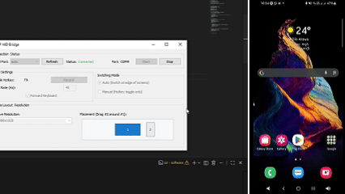

# ESP HID Bridge

ESP HID Bridge forwards a PC's mouse and keyboard to an ESP32 over USB, and
the ESP32 re-emits them as Bluetooth LE HID (combined mouse + keyboard) to a
paired phone or tablet. Your PC's own mouse and keyboard drive the phone.

## Highlights

- **Windows and macOS** senders, both written in Go, each with a native GUI.
- ESP32-C3 firmware built on ESP-IDF and NimBLE.
- Zero-config device discovery by USB VID/PID — no port picker.
- A binary, bidirectional protocol: the app shows the device's Bluetooth
  state and firmware version, and can clear stale pairings.
- Remote mode toggled by a configurable hotkey (e.g. `Alt+F7`) or by pushing
  the cursor into the edge of the screen.
- Auto-reconnect, and a hard guarantee that you can never be trapped
  controlling a device the link cannot reach.

## Demo

## Repository layout

The project has two generations. **v2 is the current one.**

| Path | Role |
|---|---|
| `firmware-idf/` | **v2 firmware.** ESP-IDF v6.0, ESP32-C3, NimBLE. |
| `host/` | **v2 sender.** Go, Windows + macOS. |
| `firmware/` | v1 firmware (Arduino sketch). Superseded. |
| `software/` | v1 Windows sender. Superseded. |

The two generations speak different wire protocols and are not
interchangeable: a v1 app cannot drive v2 firmware or vice versa. The v1
tree is kept only for boards still running the Arduino sketch, and is no
longer released — build it by hand if you need it. The retired v1 macOS app
(`software-macos/`) has been removed entirely; `host/` replaces it.

The contract that holds v2 together is the **binary wire protocol**, specified
in [`firmware-idf/docs/PROTOCOL.md`](firmware-idf/docs/PROTOCOL.md) and
implemented three times over: `firmware-idf/main/protocol.c`,
`host/internal/protocol/protocol.go`, and `firmware-idf/tools/hidctl.py`.
Changing a message means changing all of them.

## How it works

1. The sender installs a low-level input hook (Windows) or a CGEventTap
   (macOS).
2. In remote mode it swallows your real input rather than letting it reach
   the desktop, and turns it into binary frames.
3. Frames go over the ESP32-C3's native USB serial link.
4. The firmware replays them as BLE HID reports to the paired device.

## Quick start

1. **Flash the firmware** — see [`firmware-idf/README.md`](firmware-idf/README.md).
2. **Pair your phone** with the Bluetooth device `ESP-HID-ME`.
3. **Connect the ESP32-C3 to your computer** over USB.
4. **Run the sender.** On macOS, open `ESP-HID-Bridge-<version>.dmg` from
   [Releases](https://github.com/akilaid/esp-hid/releases) and drag the app
   into Applications; on Windows, download `esp-hid-bridge.exe`. See
   [`host/README.md`](host/README.md) for building from source and, on
   macOS, the permissions and Gatekeeper steps the first launch needs.
5. Press the toggle hotkey (`F9` by default) and your input goes to the
   phone. Press it again to come back. On Windows you can also push the
   cursor into the screen edge.

## Requirements

**Device:** an ESP32-C3 board. The v2 firmware uses the chip's native USB
Serial/JTAG peripheral, so no USB-serial adapter chip is involved.

**Windows:** Windows 10/11, Go 1.22+ to build from source.

**macOS:** macOS 11 or later, Go 1.22+ and the Xcode Command Line Tools to
build from source. macOS also requires two privacy permissions —
**Accessibility** and **Input Monitoring** — which the app detects and walks
you through granting.

## Remote mode

- **Switching to the device** is done with the toggle hotkey. Any single key
  or combination works — `F9` by default, through to `F20`, letters, digits,
  the keypad, and navigation keys, with any of Ctrl/Alt/Shift/Cmd.
- **On Windows** there is also **Auto** switching, which activates remote
  mode when the cursor reaches the host-side edge of your desktop. Seams
  between multiple monitors never trigger it — only the true outer boundary
  does. The macOS app is hotkey-only and does not offer this; the
  `-auto-switch` flag still enables it there for anyone who wants it.
- **Coming back** works by hotkey, by pushing the cursor against the far edge
  of the device's screen, or optionally by a deliberate left-swipe
  (`-leftreturn`). This is automatic on both platforms.
- Remote mode requires the serial link **and** a connected Bluetooth host. If
  either drops, remote mode exits, the cursor is restored, and all keys and
  buttons are released. The hotkey is deliberately inert while the link is
  down, so you cannot enter a mode you would not be able to leave.

## Firmware LED

- No Bluetooth client connected: the LED stays on.
- Client connected: a 200 ms pulse every 20 seconds.

## Settings

Stored as JSON and re-read at startup; explicit command-line flags override
them for that run.

- Windows: `%AppData%\ESP HID Bridge\settings-v2.json`
- macOS: `~/Library/Application Support/ESP HID Bridge/settings-v2.json`

## Command-line flags

Both platforms accept the same flags.

- `-port`: serial port override (default: auto-detect by USB ID `303A:1001`).
- `-rate`: movement send rate in Hz (default `45`).
- `-deadzone`: ignore move deltas up to this absolute value (default `1`).
- `-smooth`: micro-smoothing factor for small movement (default `0.2`).
- `-adaptive`: adapt send cadence when the link is congested (default `true`).
- `-slave-res`: device resolution `WIDTHxHEIGHT` for edge-aware return
  (default `1920x1080`).
- `-host-side`: where this computer sits relative to the device
  (`left|right|top|bottom`, default `left`).
- `-leftreturn`: allow returning by a quick left-swipe (default `false`).
- `-reconnect`: reconnect delay after a link failure (default `750ms`).
- `-keyboard`: forward keyboard events (default `true`).
- `-toggle`: remote-mode hotkey combo (default `F9`). Accepts `F1`–`F20`,
  `A`–`Z`, `0`–`9`, keypad keys, and navigation keys, optionally prefixed
  with `Ctrl+`, `Alt+`, `Shift+` and `Win+`/`Cmd+`.
- `-auto-switch`: enter remote mode at the screen edge (default `true`;
  the macOS GUI does not offer it and leaves it off).
- `-gui`: launch the GUI (default `true`).
- `-cli`: diagnostics only, no input capture (implies `-gui=false`).

## Troubleshooting

- **The bridge never connects.** Check that the board is running v2 firmware
  and that the USB cable carries data. `-cli` prints what the device reports.
- **The phone cannot see the device.** Use **Clear device bonds** in the app,
  then forget `ESP-HID-ME` on the phone and pair again.
- **The hotkey does nothing.** Expected while the link is down — that is the
  safety interlock. Reconnect first.
- **macOS: the mouse works but typing does not.** Either Input Monitoring is
  not granted, or another app has Secure Event Input enabled (a focused
  password field or a `sudo` prompt). The app reports both cases.
- **macOS: "Apple could not verify ESP HID Bridge…"** on first launch. The
  download is quarantined because the build is ad-hoc signed rather than
  notarized. Run
  `xattr -dr com.apple.quarantine ~/Downloads/"ESP HID Bridge.app"`, or open
  **System Settings → Privacy & Security** and click **Open Anyway**.
  (Right-click → Open no longer works on macOS 15+.)
- **macOS: permissions stop working after an update.** The release build is
  ad-hoc signed, so its identity changes with each version. Re-grant, or see
  the `tccutil` reset commands in [`host/README.md`](host/README.md).

---

**Note**: This project was developed for my personal requirements and may not
be optimum for everyone's needs. Feel free to modify it for your own
requirements.
